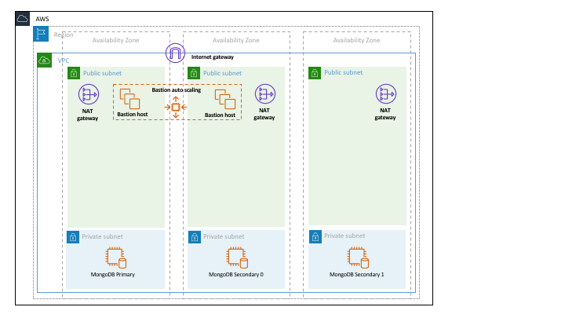
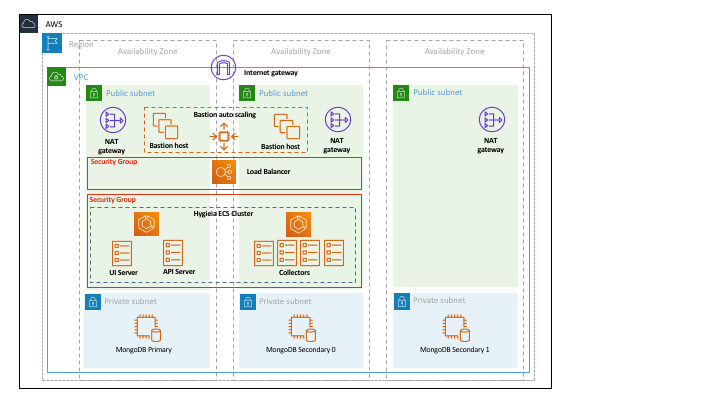

# Hygieia Quick Start
This repo is a companion to the [Hygieia](https://hygieia.github.io/) project with a goal of helping you get an initial Hygieia installation up and running quickly within about an hour. The initial configuration is deployed to AWS and capable of supporting about 100 team dashboards out of the box in a secure manner for about $200 a month in AWS hosting costs.

This repo is created and supported by [SingleStone](https://www.singlestoneconsulting.com), a technology company who is a member of the Hygieia Consortium and based in Richmond, Virginia. 

## Prerequisites
Before you start you will need the following:
1. A computer with a Bash shell installed
1. A [Git client](https://git-scm.com/downloads) is helpful if you want clone this repo, but is not required.

For AWS you will need:
1. An [AWS Account](https://aws.amazon.com/account/)
1. Permissions to run CloudFormation, create IAM roles and security groups. See [security.template](cfn/security.template) for the IAM roles and security groups created.
1. An [AWS Command Line Interface (CLI)](https://aws.amazon.com/cli/) installed and connected to your AWS account.
1. An [AWS S3 bucket](https://aws.amazon.com/s3/) in your account for storing the CloudFormation code used to launch Hygieia.

## Step 1: Install MongoDB
The first thing you need with Hygieia is a MongoDB database to store the data. We recommend following the [AWS MongoDB Quick Start](https://aws.amazon.com/quickstart/architecture/mongodb/) to setup your database. This secure implementation takes about 15 minutes to setup via CloudFormation and can run inside an existing VPC or one it creates.

When deploying the MongoDB quickstart, note the following:
- Set the `ClusterReplicaSetCount` parameter to `1`.
- For the node subnets, it is not necessary to use public subnets (i.e. subnets with a route to an Internet Gateway); private subnets are perferable.
- The database name should be `admin`.
- The database username should be `dbuser`.
- The database password should contain at least one number and one capital letter.

Once done, your environment will look like this:

## Step 2: Install Hygieia
1. Clone or download this repo locally and change to the project root directory `cd hygieia-quickstart`.
1. Create a new file named `deploy.properties` by copying the existing [example.properties](example.properties) file (`cp example.properties deploy.properties`). Modify this file to provide your environment-specific Hygieia settings and save when done. Specifically, be sure to update the following properties:
  - `SubnetA` (specific to your AWS environment)
  - `SubnetB` (specific to your AWS environment)
  - `VpcId` (specific to your AWS environment)
  - `MongoDBHost` (this will be the private IP address of the MongoDB EC2 instance created in step 1)
  - `DatabasePassword` (this will be the password you provided in step 1)
1. Modify the [bin/config.sh](bin/config.sh) file to provide the name of your S3 bucket where CloudFormation will be saved. You can optionally modify the default AWS region (`us-east-1`) and CloudFormation stack name (`Hygieia-Quickstart`) if you want.
1. From the root directory, run the command `bin/package.sh`. This merges your `deploy.properties` settings and generates CloudFormation files that are uploaded to S3 bucket defined in `bin/config.sh`.
1. From the root directory, run the command `bin/deploy.sh`. This runs CloudFormation that provisions Hygieia in AWS and starts the UI, API and Collector services configured in `deploy.properties`.

The deploy command takes about 3-4 minutes to run and creates a new CloudFormation stack named `Hygieia-Quickstart` by default. Outputs of the command include the URL of the new load balancer. Make note of it as this will be how you connect to the UI Server in the next step.

### Update Security Groups
Once the stack has finished creating, run the `bin/update-security-groups.sh` script to allow Hygieia services to access MongoDB.

When done your environment will look like this.

At this point the Hygieia UI server, API server and a set of collectors should be deployed and running. All of them should be connected to the database created in step 1. You can check this by getting the load balancer's public DNS name from the AWS console and navigating to that address in your web browser. Click the power icon in the top right corner and you should be presented with a login screen. If not, try stopping the ECS UI service's running task.

## Step 3: Configure Hygieia
In order to start collecting data within your environment, collectors need to have connection information to source systems such as Jenkins, Jira, Sonar or GitHub. Once data is being collected, you can also create dashboards.

1. Follow the [Hygieia instructions to create an Admin user](https://hygieia.github.io/Hygieia/signup.html).
1. Open a browser and using the URL from step 2, login to your Hygieia UI Server as the Admin user.
1. Configure the installed collectors via the UI Server (cog icon in top right, then "General"). Note: In order to configure a collector, the `CreateXXXXCollector` property in `deploy.properties` must be set to true. 
	1. If you'd prefer not to configure collectors in the UI, you can set collector configuration information in `deploy.properties` and re-run the `bin/package.sh` and `bin/deploy.sh` commands.
1. Follow the [Hygieia instructions to create a Team Dashboard](https://hygieia.github.io/Hygieia/create_team_dashboard.html).

If all went well you should have your first Team Dashboard up and running. Congrats!

## Costs

This quick start costs approximately $200 per month to run in AWS, making some assumptions for user traffic and data storage capacity. The costs primarily result from:

1. MongoDB: 1 × m4.large EC2 instance
1. Hygieia: 1 × Application Load Balancer (ALB)
1. Hygieia: 1 × m4.large (~7 ECS Fargate Containers)

The more collectors you enable and the more data you gather, the larger the MongoDB data storage costs.

## Feedback
If you find something unclear or have an idea for an improvement, please let us know by creating a new issue.
